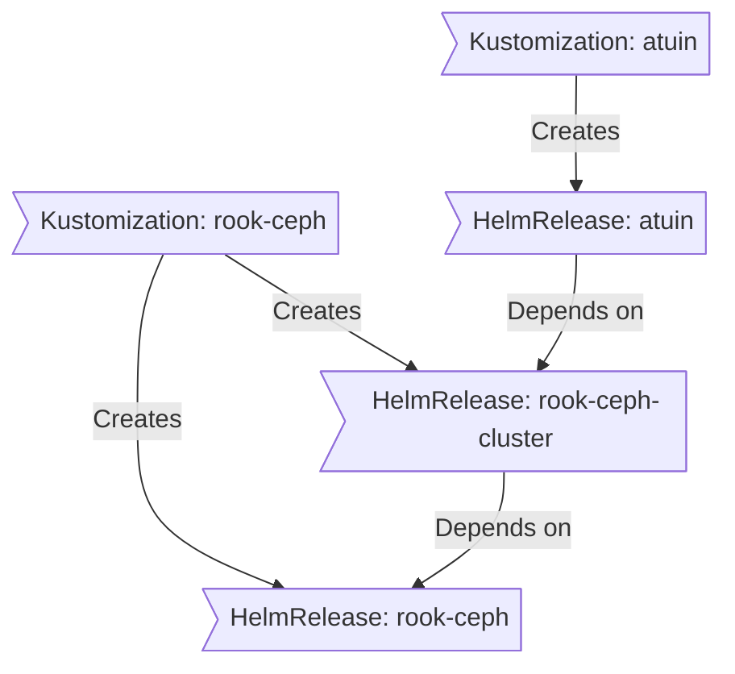

<div align="center">

###  Home Operations Repository 

_Kubernetes cluster running on TrueNAS Scale VMs, managed with Talos, Flux, and GitOps_ 

</div>

---

##  Overview

This repository contains the configuration for my homelab Kubernetes cluster built for learning, experimentation, and running self-hosted applications. The setup emphasizes Infrastructure as Code (IaC) and GitOps practices using [Talos Linux](https://www.talos.dev/), [Kubernetes](https://kubernetes.io/), [Flux](https://github.com/fluxcd/flux2), [Renovate](https://github.com/renovatebot/renovate), and [GitHub Actions](https://github.com/features/actions).

**Architecture**: The cluster runs on libvirt VMs hosted on TrueNAS Scale, providing a flexible virtualized environment that balances learning opportunities with production-like operations.

---

##  Kubernetes

The Kubernetes cluster is deployed using [Talos Linux](https://www.talos.dev) on libvirt VMs running on TrueNAS Scale. This setup provides a production-like Kubernetes environment while maintaining the flexibility to experiment and learn. The cluster features a hyper-converged architecture where compute and storage are co-located on the same nodes.

### Infrastructure Details

- **Host OS**: TrueNAS Scale with libvirt/QEMU virtualization
- **Kubernetes Distribution**: Talos Linux (immutable, minimal, secure)
- **VM Configuration**: 3 control plane nodes, each with 8 vCPUs and 32GB RAM
- **Storage Strategy**: Multi-tier approach using local NVMe for performance and distributed block storage for resilience
- **Networking**: Cilium CNI with eBPF for high-performance networking

### Core Components

- [actions-runner-controller](https://github.com/actions/actions-runner-controller): Self-hosted Github runners.
- [cert-manager](https://github.com/cert-manager/cert-manager): Creates SSL certificates for services in my cluster.
- [cilium](https://github.com/cilium/cilium): eBPF-based networking for my workloads.
- [cloudflared](https://github.com/cloudflare/cloudflared): Enables Cloudflare secure access to my routes.
- [external-dns](https://github.com/kubernetes-sigs/external-dns): Automatically syncs ingress DNS records to a DNS provider.
- [external-secrets](https://github.com/external-secrets/external-secrets): Managed Kubernetes secrets using [1Password Connect](https://github.com/1Password/connect).
- [rook](https://github.com/rook/rook): Distributed block storage for peristent storage.
- [sops](https://github.com/getsops/sops): Managed secrets for Kubernetes and Terraform which are commited to Git.
- [spegel](https://github.com/spegel-org/spegel): Stateless cluster local OCI registry mirror.
- [volsync](https://github.com/backube/volsync): Backup and recovery of persistent volume claims.

### GitOps

[Flux](https://github.com/fluxcd/flux2) watches the clusters in my [kubernetes](./kubernetes/) folder (see Directories below) and makes the changes to my clusters based on the state of my Git repository.

The way Flux works for me here is it will recursively search the `kubernetes/apps` folder until it finds the most top level `kustomization.yaml` per directory and then apply all the resources listed in it. That aforementioned `kustomization.yaml` will generally only have a namespace resource and one or many Flux kustomizations (`ks.yaml`). Under the control of those Flux kustomizations there will be a `HelmRelease` or other resources related to the application which will be applied.

[Renovate](https://github.com/renovatebot/renovate) watches my **entire** repository looking for dependency updates, when they are found a PR is automatically created. When some PRs are merged Flux applies the changes to my cluster.

### Directories

This Git repository contains the following directories under [Kubernetes](./kubernetes/).

```sh
📁 kubernetes
├── 📁 apps       # applications
├── 📁 components # re-useable kustomize components
└── 📁 flux       # flux system configuration
```

### Flux Workflow

This is a high-level look how Flux deploys my applications with dependencies. In most cases a `HelmRelease` will depend on other `HelmRelease`'s, in other cases a `Kustomization` will depend on other `Kustomization`'s, and in rare situations an app can depend on a `HelmRelease` and a `Kustomization`. The example below shows that `atuin` won't be deployed or upgrade until the `rook-ceph-cluster` Helm release is installed or in a healthy state.



---

##  DNS

---

##  Cloud Dependencies

While most infrastructure and workloads are self-hosted, I rely on cloud services for critical functions to avoid chicken/egg scenarios and ensure availability of essential services regardless of cluster state. This approach balances self-hosting benefits with operational reliability.

Alternative solutions would involve running a separate cloud-hosted Kubernetes cluster for critical services like [Vault](https://www.vaultproject.io/), [Vaultwarden](https://github.com/dani-garcia/vaultwarden), or [ntfy](https://ntfy.sh/), but the operational overhead and costs would likely exceed the current cloud service expenses.

| Service                                         | Use                                                               | Cost           |
|-------------------------------------------------|-------------------------------------------------------------------|----------------|
| [1Password](https://1password.com/)             | Secrets with [External Secrets](https://external-secrets.io/)     | ~$65/yr        |
| [Cloudflare](https://www.cloudflare.com/)       | Domain, DNS, and tunnel services                                 | ~$30/yr        |
| [Google Workspace](https://workspace.google.com/) | Email hosting and productivity suite                           | ~$72/yr        |
| [GitHub](https://github.com/)                   | Repository hosting and CI/CD with Actions                        | Free           |
| [iLert](https://www.ilert.com/)                 | Incident management and alerting                                  | Free (tier)    |
| [Pushover](https://pushover.net/)               | Mobile notifications for alerts                                   | $5 OTP         |
|                                                 |                                                                   | Total: ~$14/mo |

---

##  DNS

The cluster uses [ExternalDNS](https://github.com/kubernetes-sigs/external-dns) to automatically sync public DNS records to Cloudflare. For internal DNS resolution, [k8s-gateway](https://github.com/ori-edge/k8s_gateway) provides cluster-internal DNS services, eliminating the need for external DNS providers for private network resolution.

---

##  Hardware

### Physical Infrastructure

| Component                   | Specifications                                      | Function                          |
|-----------------------------|-----------------------------------------------------|-----------------------------------|
| **Host Server**             | Intel R2000 Server                                 | Virtualization Host               |
| ├─ **CPU**                  | 2x Intel Xeon E5-2630 v4 @ 2.20GHz (20 cores)     | VM compute resources              |
| ├─ **Memory**               | 384GB RAM                                           | VM memory allocation              |
| ├─ **Network**              | 2x 10GbE bonded NICs                               | High-speed networking             |
| └─ **Operating System**     | TrueNAS Scale                                       | VM host & storage management      |

### Storage Architecture

| Storage Tier                | Hardware                                            | Purpose                           |
|-----------------------------|-----------------------------------------------------|-----------------------------------|
| **Primary Pool**            | 12x SSD (8x 4TB + 4x 1TB) in 3x RAIDZ vdevs       | VM storage & datasets             |
| **Hot Spare**               | 1x 4TB SSD                                         | Automatic replacement             |
| **SLOG (Intent Log)**       | 2x 800GB Intel NVMe (mirrored)                     | Synchronous write acceleration    |
| **Special Metadata vdev**   | 2x 1.6TB Hitachi NVMe (mirrored)                   | Metadata & small block storage    |

### Virtual Machine Configuration

| VM Role                     | Count | vCPU | Memory | Storage Layout                    | OS            |
|-----------------------------|-------|------|--------|-----------------------------------|---------------|
| **Kubernetes Control Plane** | 3     | 8    | 32GB   | 250GB (OS) + 1TB (local) + 800GB (ceph) | Talos Linux   |

**Total VM Resources**: 24 vCPUs, 96GB RAM allocated from the 40-core, 384GB host system.

---

##  Learning & Credits

This homelab serves as a continuous learning platform for cloud-native technologies, GitOps practices, and infrastructure automation. The setup provides hands-on experience with enterprise-grade tools and practices in a controlled environment.

**Special thanks to [onedr0p](https://github.com/onedr0p)** and the [k8s-at-home](https://github.com/k8s-at-home) community. This repository was heavily inspired by onedr0p's [home-ops](https://github.com/onedr0p/home-ops) repository, which served as an excellent learning resource and foundation for understanding GitOps workflows and Kubernetes cluster management.

---

##  Stargazers

<div align="center">

<a href="https://star-history.com/#varuntirumala1/home-ops&Date">
  <picture>
    <source media="(prefers-color-scheme: dark)" srcset="https://api.star-history.com/svg?repos=varuntirumala1/home-ops&type=Date&theme=dark" />
    <source media="(prefers-color-scheme: light)" srcset="https://api.star-history.com/svg?repos=varuntirumala1/home-ops&type=Date" />
    
  </picture>
</a>

</div>

---

##  Gratitude and Thanks

Thanks to all the people who donate their time to the [Home Operations](https://discord.gg/home-operations) Discord community. Be sure to check out [kubesearch.dev](https://kubesearch.dev/) for ideas on how to deploy applications or get ideas on what you could deploy.
