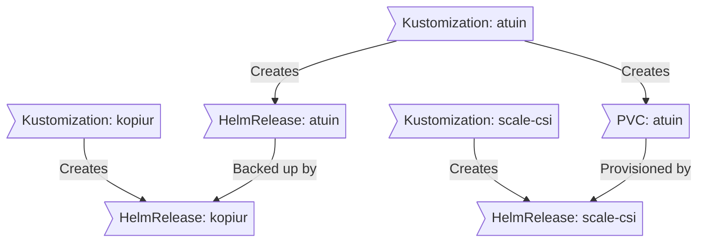

<div align="center">


###  Home Operations Repository 

_Kubernetes on Fedora CoreOS + kubeadm &middot; TrueNAS NVMe-oF storage (scale-csi) &middot; GitOps managed_ 

<br/>

<picture>
  <source media="(prefers-color-scheme: dark)" srcset="https://kromgo-proxy.pixel-forge.workers.dev/stack_panel?theme=dark">
  <source media="(prefers-color-scheme: light)" srcset="https://kromgo-proxy.pixel-forge.workers.dev/stack_panel?theme=light">
  
</picture>
<br/>
<picture>
  <source media="(prefers-color-scheme: dark)" srcset="https://kromgo-proxy.pixel-forge.workers.dev/health_panel?theme=dark">
  <source media="(prefers-color-scheme: light)" srcset="https://kromgo-proxy.pixel-forge.workers.dev/health_panel?theme=light">
  
</picture>
<br/>
<picture>
  <source media="(prefers-color-scheme: dark)" srcset="https://kromgo-proxy.pixel-forge.workers.dev/usage_panel?theme=dark">
  <source media="(prefers-color-scheme: light)" srcset="https://kromgo-proxy.pixel-forge.workers.dev/usage_panel?theme=light">
  
</picture>
<br/>
<picture>
  <source media="(prefers-color-scheme: dark)" srcset="https://kromgo-proxy.pixel-forge.workers.dev/gitops_panel?theme=dark">
  <source media="(prefers-color-scheme: light)" srcset="https://kromgo-proxy.pixel-forge.workers.dev/gitops_panel?theme=light">
  
</picture>
<br/>
<picture>
  <source media="(prefers-color-scheme: dark)" srcset="https://kromgo-proxy.pixel-forge.workers.dev/network_status?theme=dark">
  <source media="(prefers-color-scheme: light)" srcset="https://kromgo-proxy.pixel-forge.workers.dev/network_status?theme=light">
  
</picture>

</div>

---

##  Overview

This repository contains the configuration for my homelab Kubernetes cluster built for learning, experimentation, and running self-hosted applications. The setup emphasizes Infrastructure as Code (IaC) and GitOps practices using [Fedora CoreOS](https://fedoraproject.org/coreos/) + [kubeadm](https://kubernetes.io/docs/reference/setup-tools/kubeadm/), [Kubernetes](https://kubernetes.io/), [Flux](https://github.com/fluxcd/flux2), [Renovate](https://github.com/renovatebot/renovate), and [GitHub Actions](https://github.com/features/actions).

**Architecture**: The cluster runs on Proxmox VE 9.2 with [scale-csi](https://github.com/GizmoTickler/scale-csi) providing primary storage — NVMe-oF/TCP volumes served by a TrueNAS SCALE box over its WebSocket API — node-local scratch volumes via the OpenEBS hostpath provisioner backed by a dedicated NVMe ZFS pool (`nvme-scratch`) on the hypervisor, and [kopiur](https://github.com/home-operations/kopiur) (Kopia) for PVC backup and restore.

---

##  homeops-cli — Custom Go CLI

> **Built from scratch** — ~25,000 lines of Go powering the entire cluster lifecycle.

[`homeops-cli`](./cmd/homeops-cli) is a purpose-built command-line tool that automates every operational aspect of this infrastructure. It is not a wrapper around shell scripts — it's a full Go application with 19 internal packages, native API clients, and embedded template rendering.

The built binary and CLI command name are `homeops-cli`.

| Command | What it does |
|---------|-------------|
| `homeops-cli bootstrap --provider flatcar` | End-to-end kubeadm cluster init (the `flatcar` provider also drives Fedora CoreOS nodes): `kubeadm init`/`join` over SSH, then Cilium + CRDs + Flux, with preflight checks and 1Password secret injection |
| `homeops-cli fcos deploy-vm` | Provisions Fedora CoreOS VMs on Proxmox (Ignition via fw_cfg) with batch/concurrent deployment |
| `homeops-cli fcos render-ignition` | Renders the Butane→Ignition config for a node (debug/inspection) |
| `homeops-cli fcos os-status` | Shows rpm-ostree deployment + greenboot status across nodes |
| `homeops-cli cluster replace-node` | Rebuilds a node in place (drain, etcd member removal, redeploy, rejoin) |
| `homeops-cli k8s view-secret` | Decodes secret data with interactive secret and namespace selection |
| `homeops-cli volsync ...` | Legacy VolSync snapshot/restore/migrate commands — VolSync is no longer installed (backups moved to kopiur) |
| `homeops-cli workstation` | Developer workstation setup and validation |

**Key internals:**

- **Native API clients** for Proxmox VE and TrueNAS Scale, plus Fedora CoreOS stream / Flatcar release-image resolution — no shelling out
- **1Password CLI integration** for zero-plaintext secret management
- **Embedded Butane→Ignition transpilation** (CoreOS Butane library) + kubeadm v1beta4 config rendering for Fedora CoreOS (and Flatcar) nodes
- **Interactive TUI** with rich prompts, spinners, and progress indicators
- **Full test suite** with unit and integration tests

See the dedicated CLI guide at [`cmd/homeops-cli/README.md`](./cmd/homeops-cli/README.md) for current operator workflows, and the supporting docs for [testing](./cmd/homeops-cli/docs/TESTING.md), [code review findings](./cmd/homeops-cli/docs/CODE_REVIEW.md), and [coverage notes](./cmd/homeops-cli/docs/COVERAGE_REVIEW.md).

```
cmd/homeops-cli/
├── cmd/           # CLI commands (bootstrap, cluster, fcos/flatcar, volsync, kubernetes, workstation)
├── internal/      # packages: proxmox, truenas, fcos, flatcar, ssh, iso, config, security, ui, ...
├── main.go        # Cobra root command with signal handling
└── Makefile       # Build, test, lint, coverage
```

##  Kubernetes

The Kubernetes cluster is deployed using [Fedora CoreOS](https://fedoraproject.org/coreos/) with [kubeadm](https://kubernetes.io/docs/reference/setup-tools/kubeadm/) on Proxmox VE 9.2 VMs. Primary storage is provided by [scale-csi](https://github.com/GizmoTickler/scale-csi), a purpose-built CSI driver that provisions ZFS-backed NVMe-oF/TCP, iSCSI, and NFS volumes on a TrueNAS SCALE appliance (NVMe SLOG-backed, sub-millisecond commit latency), with [kopiur](https://github.com/home-operations/kopiur) (Kopia) handling per-app backup and restore.

### Infrastructure Details

- **Hypervisor**: Proxmox VE 9.2 with KVM/QEMU virtualization
- **Primary Storage**: scale-csi (NVMe-oF/TCP; the driver also supports iSCSI and NFS) on TrueNAS SCALE — `scale-nvmeof` is the default (and only scale-csi) StorageClass; secure-by-default NVMe host-NQN allowlisting; driver-side orphan GC
- **Local Storage**: OpenEBS hostpath provisioner on a dedicated 2x NVMe ZFS pool (`nvme-scratch`) on the Proxmox host — high-throughput scratch for download landing zones and CI runner work volumes
- **Network Infrastructure**:
  - 4x 10GbE Intel X540 NICs bonded via IEEE 802.3ad LACP (40Gbps) on the Proxmox host
  - Cisco switch providing high-speed interconnect
  - Jumbo frames (MTU 9000) enabled end-to-end
- **OS / Distribution**: Fedora CoreOS 44 (immutable, rpm-ostree; Zincati auto-updates disabled, greenboot health checks layered) bootstrapped with **kubeadm** (v1beta4); Kubernetes **v1.36.2**, containerd 2.3. The kubelet/kubeadm/kubectl/crictl/CNI binaries are delivered as a **directory systemd-sysext** (`/var/lib/extensions/kubernetes`) built on first boot by `homeops-install-k8s-sysext`, which is also the documented Kubernetes binary upgrade path (no systemd-sysupdate on FCOS).
- **Control-plane endpoint**: kube-vip (ARP/L2) VIP `192.168.123.253:6443` — CNI-independent, so it is usable as the `kubeadm` control-plane endpoint during init/join.
- **VM Configuration**: 3 control plane nodes, each with 16 vCPUs, 80GB RAM, and NUMA-pinned CPU affinity
- **Storage Strategy**: Multiple storage tiers per VM:
  - **Boot Disk**: 100GB VirtIO SCSI disk on the `vm-ssd` ZFS mirror for the FCOS OS (`/dev/sda`)
  - **Local Scratch**: 451GB VirtIO SCSI zvol from the `nvme-scratch` ZFS pool (ext4, `LABEL=openebs-nvme`), mounted at `/var/mnt/nvme-hostpath` for OpenEBS hostPath workloads (`/dev/sdb`)
  - **App Volumes**: attached on demand by scale-csi as NVMe-oF/TCP (or iSCSI) block devices from TrueNAS — no static data disks
- **Networking**:
  - Cilium CNI with eBPF datapath
  - kgateway (Gateway API) for ingress with L2/BGP announcements
  - VirtIO network adapters: 16 queues on the primary NIC, 8 on VLAN 90, and no queues key on VLAN 20; the four storage-fabric NICs are SR-IOV VFs passed through from the Proxmox host
  - Network interface: `eth0` (the primary NIC name is pinned by a udev `.link` file, not `ens18`)
- **Guest Integration**: QEMU Guest Agent for enhanced VM management
- **Ingress**: kgateway (Gateway API) with Cilium L2/BGP LoadBalancer services
- **DNS**: external-dns for Cloudflare (public) and PowerDNS via RFC2136 (internal) DNS management

### Core Components

- [actions-runner-controller](https://github.com/actions/actions-runner-controller): Self-hosted GitHub runners for CI/CD workflows.
- [cert-manager](https://github.com/cert-manager/cert-manager): Automated TLS certificate management with Google Trust Services.
- [cilium](https://github.com/cilium/cilium): eBPF-based networking, security, and L2/BGP announcements for LoadBalancer IP allocation.
- [cloudflared](https://github.com/cloudflare/cloudflared): Secure tunnels to Cloudflare for external access via Cloudflare Tunnel.
- [kgateway](https://github.com/kgateway-dev/kgateway): Gateway API controller using Envoy proxy for ingress routing and traffic management.
- [external-dns](https://github.com/kubernetes-sigs/external-dns): Automated DNS record management with Cloudflare and PowerDNS (RFC2136) integration.
- [external-secrets](https://github.com/external-secrets/external-secrets): Kubernetes External Secrets Operator with 1Password Connect integration.
- [flux](https://github.com/fluxcd/flux2): GitOps continuous delivery for Kubernetes with SOPS decryption support.
- [openebs](https://github.com/openebs/openebs): Local persistent volume provisioner for hostPath scratch storage on the dedicated `nvme-scratch` NVMe ZFS pool.
- [scale-csi](https://github.com/GizmoTickler/scale-csi): Primary storage — a purpose-built TrueNAS SCALE CSI driver (WebSocket API, zero SSH) providing NVMe-oF/TCP, iSCSI, and NFS StorageClasses with snapshots, detached clones, expansion, and a driver-side orphan reconciler.
- [sops](https://github.com/getsops/sops): Managed secrets for Kubernetes using age encryption, committed to Git.
- [spegel](https://github.com/spegel-org/spegel): Stateless cluster local OCI registry mirror for improved image pull performance.
- [kured](https://github.com/kubereboot/kured): Coordinates safe, one-at-a-time node reboots (GitOps-managed) when a node flags `/run/reboot-required`. Zincati is disabled on the FCOS nodes, so OS updates never reboot a node on their own. [system-upgrade-controller](https://github.com/rancher/system-upgrade-controller) hosts the upgrade Plans (see `apps/system-upgrade`).
- [kopiur](https://github.com/home-operations/kopiur): Kopia-based backup and restore of persistent volume claims (hourly `SnapshotSchedule`s to the `nas-s3` ClusterRepository; restore-on-create via a `Restore` populator).

### GitOps

[Flux](https://github.com/fluxcd/flux2) provides GitOps continuous delivery, watching the [kubernetes](./kubernetes/) folder and applying changes based on Git repository state. The setup includes:

- **SOPS Integration**: Automatic decryption of secrets using age encryption
- **Dependency Management**: HelmReleases and Kustomizations with explicit dependencies
- **Multi-tenancy**: Namespace isolation with proper RBAC
- **Webhook Integration**: GitHub webhook receiver for immediate sync on push

The workflow recursively searches the `kubernetes/apps` folder for `kustomization.yaml` files, which typically contain namespace resources and Flux Kustomizations (`ks.yaml`). Each Kustomization manages HelmReleases or other Kubernetes resources for applications.

[Renovate](https://github.com/renovatebot/renovate) provides automated dependency management across the entire repository, creating pull requests for updates to:
- Container images with digest pinning
- Helm chart versions
- Kubernetes manifests
- GitHub Actions workflows

### Repository Structure

This Git repository is organized for GitOps workflows and infrastructure management:

```sh
📁 home-ops
├── 📁 kubernetes
│   ├── 📁 apps          # Application deployments by namespace
│   │   ├── 📁 actions-runner-system # Self-hosted GitHub runners
│   │   ├── 📁 auth           # Identity provider (Pocket ID)
│   │   ├── 📁 automation     # Home Assistant and workflow automation (n8n)
│   │   ├── 📁 cert-manager   # Certificate management
│   │   ├── 📁 database       # CloudNativePG operator and clusters
│   │   ├── 📁 downloads      # Media acquisition stack
│   │   ├── 📁 external-secrets # Secret management
│   │   ├── 📁 flux-system    # Flux controllers
│   │   ├── 📁 kopiur-system  # Volume backup and recovery (kopiur + Kopia UI)
│   │   ├── 📁 kube-system    # Core Kubernetes components
│   │   ├── 📁 media          # Media serving applications
│   │   ├── 📁 network        # Networking applications
│   │   ├── 📁 observability  # Monitoring and logging
│   │   ├── 📁 openebs-system # Local storage provisioner
│   │   ├── 📁 scale-csi      # TrueNAS CSI driver (NVMe-oF/iSCSI/NFS)
│   │   ├── 📁 self-hosted    # Productivity and tools
│   │   ├── 📁 system         # Node device plugins
│   │   └── 📁 system-upgrade # Upgrade Plans and reboot coordination
│   ├── 📁 components    # Reusable Kustomize components
│   │   ├── 📁 alerts         # AlertManager configurations
│   │   ├── 📁 cluster-secret # Cluster-wide secrets
│   │   ├── 📁 kopiur         # PVC + kopiur backup/restore wiring
│   │   └── 📁 nfs-scaler     # NFS availability scaling
│   └── 📁 flux          # Flux system configuration
├── 📁 cmd               # HomeOps CLI source code
│   └── 📁 homeops-cli   # Go-based automation tool
└── 📁 scripts           # Automation and utility scripts
```

> Node OS + kubeadm configuration (Butane/Ignition, kubeadm v1beta4, kube-vip) lives as **embedded templates inside `cmd/homeops-cli`**, not a top-level directory.

### Flux Workflow

This is a high-level look how Flux deploys my applications with dependencies. In most cases a `HelmRelease` will depend on other `HelmRelease`'s, in other cases a `Kustomization` will depend on other `Kustomization`'s, and in rare situations an app can depend on a `HelmRelease` and a `Kustomization`. The example below shows an app whose persistent volume is provisioned by scale-csi and backed up by kopiur — the app's PVC is created with a `dataSourceRef` to a kopiur `Restore`, so data restores automatically on (re)creation.


```mermaid
graph TD
    A>Kustomization: scale-csi] -->|Creates| B[HelmRelease: scale-csi]
    C>Kustomization: kopiur] -->|Creates| D[HelmRelease: kopiur]
    E>Kustomization: atuin] -->|Creates| F(HelmRelease: atuin)
    E>Kustomization: atuin] -->|Creates| G(PVC: atuin on scale-nvmeof)
    G>PVC: atuin] -->|Provisioned by| B>HelmRelease: scale-csi]
    F>HelmRelease: atuin] -->|Backed up by| D>HelmRelease: kopiur]
```

### Automation & Tooling

The repository includes comprehensive automation for cluster management through a custom Go-based CLI:

#### HomeOps CLI (`cmd/homeops-cli`)

A purpose-built Go application that provides complete infrastructure automation:

**Core Capabilities:**
- **Bootstrap**: Complete cluster initialization (`--provider flatcar`, which also drives FCOS nodes: kubeadm init/join over SSH, then Cilium/CRDs/Flux) with preflight checks and 1Password integration
- **FCOS Provisioning**: Butane→Ignition rendering, kubeadm config generation, and `kubeadm init`/`join` orchestration over SSH (`cluster.os: fcos` in `homeops.yaml`; Flatcar remains selectable)
- **VM Management**: Proxmox VE 9.2 VM creation booting the Fedora CoreOS qemu image with Ignition injected via qemu fw_cfg
- **Node Lifecycle**: `cluster rehearse-node` drills and `cluster replace-node` in-place rebuilds
- **Kubernetes Management**: Deployment restarts, PVC browsing, and maintenance operations

**Key Commands:**
```bash
# Bootstrap entire cluster
homeops-cli bootstrap

# FCOS node provisioning + cluster bootstrap (kubeadm)
homeops-cli fcos deploy-vm --power-on                 # all os: fcos nodes; stages the stable-stream image
homeops-cli fcos render-ignition --node k8s-0         # inspect rendered Ignition
homeops-cli fcos os-status                            # rpm-ostree + greenboot status
homeops-cli bootstrap --provider flatcar              # kubeadm init/join + Cilium/CRDs/Flux (FCOS nodes too)

# Kubernetes and Flux operations
homeops-cli k8s view-secret
homeops-cli k8s apply-ks ./kubernetes/apps/observability/grafana/ks.yaml --name grafana-instance

```

**Supporting Tools:**
- **Template Rendering**: Embedded Butane→Ignition transpilation (CoreOS Butane) + kubeadm v1beta4 configs for FCOS (and Flatcar)
- **Secret Injection**: [1Password CLI](https://developer.1password.com/docs/cli/) integration for secure secret management
- **Environment Management**: [mise](https://github.com/jdx/mise) for tool and environment variable management
- **Configuration Validation**: Pre-commit hooks with kubeconform and YAML linting
- **CI/CD**: GitHub Actions for automated testing, schema validation, and deployment

---

##  Cloud Dependencies

While most infrastructure and workloads are self-hosted, I rely on cloud services for critical functions to avoid chicken/egg scenarios and ensure availability of essential services regardless of cluster state. This approach balances self-hosting benefits with operational reliability.

Alternative solutions would involve running a separate cloud-hosted Kubernetes cluster for critical services like [Vault](https://www.vaultproject.io/), [Vaultwarden](https://github.com/dani-garcia/vaultwarden), or [ntfy](https://ntfy.sh/), but the operational overhead and costs would likely exceed the current cloud service expenses.

| Service                                         | Use                                                               | Cost           |
|-------------------------------------------------|-------------------------------------------------------------------|----------------|
| [1Password](https://1password.com/)             | Secrets with [External Secrets](https://external-secrets.io/)     | ~$65/yr        |
| [Cloudflare](https://www.cloudflare.com/)       | Domain, DNS, and tunnel services                                 | ~$30/yr        |
| [Google Workspace](https://workspace.google.com/) | Email hosting and productivity suite                           | ~$72/yr        |
| [GitHub](https://github.com/)                   | Repository hosting and CI/CD with Actions                        | Free           |
| [iLert](https://www.ilert.com/)                 | Incident management and alerting                                  | Free (tier)    |
| [Pushover](https://pushover.net/)               | Mobile notifications for alerts                                   | $5 OTP         |
|                                                 |                                                                   | Total: ~$14/mo |

---

##  DNS & Networking

The cluster implements a sophisticated networking architecture using Cilium and kgateway (Gateway API):

### External Access
- **Cloudflare Tunnel**: Secure external access via `cloudflared` without port forwarding
- **External DNS (Cloudflare)**: Automatic DNS record management in Cloudflare for public services
- **Gateway API**: kgateway-based ingress with dedicated LoadBalancer IPs per application

### Internal Resolution
- **External DNS (PowerDNS)**: external-dns deployment using RFC2136 provider for internal DNS record management via PowerDNS
- **CoreDNS**: Kubernetes cluster DNS with custom configurations
- **Cilium Announcements**: Cilium L2/BGP announcements for LoadBalancer IP allocation

### Network Architecture
- **Physical Layer**:
  - 40Gbps LACP bond aggregating 4x 10GbE Intel X540 NICs
  - IEEE 802.3ad Link Aggregation Control Protocol (LACP)
  - Jumbo frames (MTU 9000) enabled end-to-end
  - Bidirectional bandwidth between Proxmox host and TrueNAS Scale
- **CNI**: Cilium with eBPF datapath for high-performance networking
- **Load Balancing**: Maglev algorithm with DSR (Direct Server Return) mode
- **IP Management**: Kubernetes IPAM with native routing (Pod CIDR: 10.42.0.0/16)
- **BGP Peering**:
  - Cilium ASN: 64550
  - Cisco C9300 ASN: 64541
  - LoadBalancer IP pool: 192.168.255.0/24
- **Gateway IPs**: LoadBalancer services advertised via L2 and BGP
- **Kernel Optimizations**:
  - TCP Congestion Control: BBR
  - TCP Buffer Sizes: 64MB max
  - Socket Buffers: 128MB (rcvbuf/sndbuf)
  - NFS: session trunking across the four storage VLANs (`nconnect=1`, `max_connect=16`)

---

##  Applications

The cluster hosts a variety of self-hosted applications organized by namespace and function:

### Productivity & Tools (self-hosted namespace)

| Application | Purpose | Access |
|-------------|---------|--------|
| [Atuin](https://github.com/atuinsh/atuin) | Shell history sync | `sh.${SECRET_DOMAIN}` |
| [IT-Tools](https://github.com/CorentinTh/it-tools) | Developer utilities | `it-tools.${SECRET_DOMAIN}` |
| [NetBox](https://github.com/netbox-community/netbox) | DCIM/IPAM source of truth | `netbox.${SECRET_DOMAIN}` |
| [webhook](https://github.com/adnanh/webhook) | HTTP-triggered hooks | `webhook.${SECRET_DOMAIN}` |

### Content & Finance (self-hosted namespace)

| Application | Purpose | Access |
|-------------|---------|--------|
| [Actual](https://github.com/actualbudget/actual) | Personal budgeting | `actual.${SECRET_DOMAIN}` |
| [FreshRSS](https://github.com/FreshRSS/FreshRSS) | RSS feed aggregator | `rss.${SECRET_DOMAIN}` |

All self-hosted apps now share the `self-hosted` namespace so kopiur movers and Kopia ownership stay aligned (snapshots live under identities like `app@self-hosted:/data`).

### Media & Requests (media namespace)

| Application | Purpose | Access |
|-------------|---------|--------|
| [Seerr](https://github.com/seerr-team/seerr) | Media discovery & request management | `requests.${SECRET_DOMAIN}` |

Media workloads live in the `media` namespace so kopiur/Kopia identities follow `app@media:/data` for consistent restores.

### Downloads & Indexers (downloads namespace)

| Application | Purpose | Access |
|-------------|---------|--------|
| [Autobrr](https://github.com/autobrr/autobrr) | Real-time announce filtering & actions | `autobrr.${SECRET_DOMAIN}` |
| [Bazarr](https://github.com/morpheus65535/bazarr) | Subtitle management for Radarr/Sonarr libraries | `bazarr.${SECRET_DOMAIN}` |
| [NZBGet](https://github.com/nzbgetcom/nzbget) | Usenet downloader | `nzbget.${SECRET_DOMAIN}` |
| [Pinchflat](https://github.com/kieranjeglin/pinchflat) | Long-form video & podcast archiving | `pinchflat.${SECRET_DOMAIN}` |
| [Prowlarr](https://github.com/Prowlarr/Prowlarr) | Indexer proxy & search aggregator | `prowlarr.${SECRET_DOMAIN}` |
| [qBittorrent](https://github.com/qbittorrent/qBittorrent) | VPN-protected torrent client with VueTorrent UI | `qbittorrent.${SECRET_DOMAIN}` |
| [Qui](https://github.com/autobrr/qui) | Autobrr queue monitor & dashboard | `qui.${SECRET_DOMAIN}` |
| [Radarr](https://github.com/Radarr/Radarr) | Movie library automation | `radarr.${SECRET_DOMAIN}` |
| [Recyclarr](https://github.com/Recyclarr/Recyclarr) | Radarr/Sonarr config synchronisation | Internal only |
| [Sonarr](https://github.com/Sonarr/Sonarr) | TV library automation | `sonarr.${SECRET_DOMAIN}` |

The entire download stack now lives in the `downloads` namespace so kopiur movers and Kopia ownership stay aligned (`app@downloads:/data`) and restores remain consistent.

### Automation & Workflows (automation namespace)

| Application | Purpose | Access |
|-------------|---------|--------|
| [Home Assistant](https://github.com/home-assistant/core) | Home automation | `home-assistant.${SECRET_DOMAIN}` |
| [n8n](https://github.com/n8n-io/n8n) | Workflow automation & integrations | `n8n.${SECRET_DOMAIN}` |

### Identity (auth namespace)

| Application | Purpose | Access |
|-------------|---------|--------|
| [Pocket ID](https://github.com/pocket-id/pocket-id) | OIDC identity provider (passkeys) | `id.${SECRET_DOMAIN}` |

Automation workloads run in the `automation` namespace so kopiur restores and Kopia ownership continue to match `app@automation:/data`.

### Observability Stack (observability namespace)

Fully native [VictoriaMetrics](https://victoriametrics.com/) stack — single vendor, native protocols, no translation layers.

| Application | Purpose | Access |
|-------------|---------|--------|
| [VMSingle](https://github.com/VictoriaMetrics/VictoriaMetrics) | Metrics storage (300Gi, 14d retention) | `metrics.${SECRET_DOMAIN}` |
| [VMAgent](https://github.com/VictoriaMetrics/VictoriaMetrics) | Metrics scraping with streaming aggregation | Internal only |
| [VMAuth](https://github.com/VictoriaMetrics/VictoriaMetrics) | Unified auth proxy (host + path routing) | Routes all external/Grafana traffic |
| [VMAlert](https://github.com/VictoriaMetrics/VictoriaMetrics) | Metrics + log alerting (2 instances) | Internal only |
| [VMAlertManager](https://github.com/VictoriaMetrics/VictoriaMetrics) | Alert routing to Pushover | `alertmanager.${SECRET_DOMAIN}` |
| [VictoriaLogs](https://github.com/VictoriaMetrics/VictoriaMetrics) | Log storage with native syslog ingestion (500Gi, 14d) | `logs.${SECRET_DOMAIN}` |
| [vlagent](https://github.com/VictoriaMetrics/VictoriaMetrics) | K8s pod log collection (DaemonSet) | Internal only |
| [vmbackup](https://github.com/VictoriaMetrics/VictoriaMetrics) | Daily incremental metrics backup to NFS | Internal only |
| [Grafana](https://github.com/grafana/grafana) | Dashboards via grafana-operator | `grafana.${SECRET_DOMAIN}` |
| [Blackbox Exporter](https://github.com/prometheus/blackbox_exporter) | ICMP/HTTP/TCP probing | Internal only |
| [Gatus](https://github.com/TwiN/gatus) | Uptime monitoring | `status.${SECRET_DOMAIN}` |
| [KEDA](https://github.com/kedacore/keda) | Event-driven autoscaling | Internal only |

**Log pipeline:** Pod logs → vlagent (native protocol) → VictoriaLogs. Network syslog (Cisco/VyOS/UniFi) → VictoriaLogs native syslog listener (UDP 514/5514/5515 on LB 192.168.255.254). **No fluent-bit, no vector.**

### Storage & Infrastructure

| Application | Purpose | Access |
|-------------|---------|--------|
| [scale-csi](https://github.com/GizmoTickler/scale-csi) | Primary storage — TrueNAS NVMe-oF/iSCSI/NFS CSI driver | Internal only |
| [OpenEBS](https://github.com/openebs/openebs) | Local persistent volume provisioner (NVMe ZFS scratch) | Internal only |
| [kopiur](https://github.com/home-operations/kopiur) | Kopia-based PVC backup/restore operator | Internal only |
| [Kopia](https://github.com/kopia/kopia) | Repository browser UI | `kopia.${SECRET_DOMAIN}` |

All applications use kgateway (Gateway API) for ingress with automatic TLS certificates from Google Trust Services via cert-manager.

---

##  Storage Architecture

The cluster uses a multi-tier storage architecture with scale-csi (TrueNAS SCALE) as the primary storage layer:

### Storage Tiers

| Tier | Provider | StorageClass | Use Case |
|------|----------|--------------|----------|
| **NVMe-oF Block** | scale-csi | `scale-nvmeof` (default) | Application PVCs — highest IOPS, sub-ms commit latency |
| **Local Scratch** | OpenEBS | `openebs-hostpath` | Download landing zones + CI runner work volumes on the node-local `nvme-scratch` zvol |
| **Backup** | kopiur + Kopia | — | Automated PVC backup and restore |

The driver also supports iSCSI and NFS, but no StorageClass for either is currently deployed.

### scale-csi Configuration

[scale-csi](https://github.com/GizmoTickler/scale-csi) is a purpose-built CSI driver for TrueNAS SCALE, talking exclusively to its WebSocket JSON-RPC API (zero SSH):

- **Backend**: TrueNAS SCALE all-flash ZFS pool with mirrored NVMe SLOG (~1ms fsync commit latency) and NVMe L2ARC
- **Protocols**: NVMe-oF/TCP (primary), iSCSI, and NFS from a single driver
- **Security**: NVMe subsystem host-NQN allowlisting (secure-by-default, no `allowAnyHost`), non-root controller, path-traversal-hardened volume IDs
- **Data safety**: detached (fully independent) volumes from snapshots, foreign-snapshot deletion guards, and a driver-side orphan reconciler (read-only detection with Prometheus gauges + a gated, capped nightly GC)
- **Features**: snapshots/clones/expansion, VolumeSnapshotClass `scale-snapshot`, online NVMe-oF expansion, integrated metrics + alerts

### Backup Strategy

[kopiur](https://github.com/home-operations/kopiur) with [Kopia](https://github.com/kopia/kopia) provides automated backup (wired per app by the `kubernetes/components/kopiur/backup` component):

- **SnapshotPolicy + SnapshotSchedule**: Hourly snapshots of PVCs (from a `scale-snapshot` VolumeSnapshot) to the S3-backed `nas-s3` ClusterRepository; keeps 24 hourly + 7 daily
- **Restore**: Point-in-time recovery — the app PVC's `dataSourceRef` points at a kopiur `Restore`, so data restores on (re)creation
- **Identity Alignment**: Namespace-based identity (`app@namespace:/data`) for consistent restores

---

##  Hardware

### Physical Infrastructure

| Component                   | Specifications                                      | Function                          |
|-----------------------------|-----------------------------------------------------|-----------------------------------|
| **Proxmox Host**            | Proxmox VE 9.2 (KVM/QEMU)                          | VM compute & management           |
| ├─ **CPU**                  | 2x Intel Xeon E5-2697A v4 @ 2.60GHz (32 cores / 64 threads) | VM compute resources     |
| ├─ **Memory**               | 512GB DDR4-2400 ECC (16x 32GB)                     | VM memory allocation              |
| ├─ **Network**              | 4x 10GbE Intel X540 NICs (40Gbps LACP to Cisco switch) | High-speed VM networking    |
| └─ **Storage**              | 2x SSD (ZFS mirror `vm-ssd` — VM boot) + 2x NVMe (ZFS pool `nvme-scratch`, no redundancy) | VM boot mirror + local scratch zvols |
| **Storage Server**          | TrueNAS Scale                                       | iSCSI, NVMe-oF & NFS storage     |
| ├─ **CPU**                  | 2x Intel Xeon E5-2690 v4 @ 2.60GHz (28 cores / 56 threads) | Storage processing       |
| ├─ **Memory**               | 120GB DDR4-2400 ECC (8x 16GB, reduced for VM allocation) | ZFS ARC cache and services |
| ├─ **L2ARC**                | 2x 1TB NVMe (1.8TB read cache)                     | Extended read cache               |
| ├─ **SLOG**                 | 2x 60GB NVMe (mirrored)                            | Synchronous write log             |
| ├─ **Network**              | 4x 10GbE Intel X540 NICs (40Gbps LACP to Cisco switch) | Storage network        |
| └─ **Protocols**            | iSCSI (block) + NVMe-oF (block) + NFS 4.2 (file)  | Primary k8s storage via scale-csi |
| **Network Switch**          | Cisco C9300                                         | Infrastructure interconnect       |
| ├─ **LACP Configuration**   | IEEE 802.3ad Link Aggregation (40Gbps total)      | High-bandwidth storage path       |
| ├─ **BGP Peering**          | AS 64541 (peering with Cilium AS 64550)           | LoadBalancer IP advertisement     |
| └─ **MTU**                  | Jumbo frames (9000 bytes) enabled                  | Optimized large frame throughput  |

### Storage Architecture

| Storage Tier                | Hardware                                            | Purpose                           |
|-----------------------------|-----------------------------------------------------|-----------------------------------|
| **TrueNAS Primary Pool**    | 3x RAIDZ1 vdevs (3 disks each = 28.5TB usable)    | scale-csi volumes (NVMe-oF/iSCSI zvols + NFS) + media exports |
| **SLOG (Intent Log)**       | 2x 60GB NVMe (mirrored)                            | Synchronous write acceleration    |
| **L2ARC (Read Cache)**      | 2x 1TB NVMe (1.8TB total)                          | Extended ARC read cache           |

### Virtual Machine Configuration

| VM Role                     | Count | vCPU | Memory | Storage Layout                                              | OS            |
|-----------------------------|-------|------|--------|-------------------------------------------------------------|---------------|
| **Kubernetes Control Plane** | 3     | 16     | 80GB   | 100GB boot (`vm-ssd` mirror) + 451GB local scratch (`nvme-scratch` zvol) | Fedora CoreOS 44 + kubeadm (k8s v1.36.2) |

**Storage Details**:
- **Boot Disk** (`scsi0`, `/dev/sda`): 100GB VirtIO SCSI disk on the `vm-ssd` ZFS mirror for the FCOS OS
- **Local Scratch** (`scsi4`, `/dev/sdb`): 451GB VirtIO SCSI zvol from the `nvme-scratch` ZFS pool (ext4, `LABEL=openebs-nvme`), mounted at `/var/mnt/nvme-hostpath` for OpenEBS hostPath workloads
- **App Volumes**: attached dynamically by scale-csi as NVMe-oF/TCP (or iSCSI) devices from TrueNAS — no static data disks

**VM Configuration**:
- **Provisioning**: Ignition via qemu **fw_cfg** (`opt/com.coreos/config`) — the rendered Ignition is attached at VM create; the disk imports the Fedora CoreOS qemu image (no install ISO)
- **BIOS**: OVMF (UEFI)
- **CPU Type**: `host,flags=+pdpe1gb;-spec-ctrl`
- **Network**: VirtIO on `vmbr0`; primary `net0` uses MTU 9000, VLAN 999, and 16 queues; VLAN 20 `net1` uses MTU 1500 with no queues key; VLAN 90 `net2` uses MTU 1500 and 8 queues; the four storage-fabric NICs are SR-IOV VFs (`hostpci0`-`hostpci3`)
- **Guest Agent**: QEMU Guest Agent for enhanced management
- **Machine Type**: Q35 chipset

**CPU & Memory Optimization**:
- **NUMA Pinning**: Each VM is pinned to specific CPU cores with HT siblings for optimal memory locality
  - k8s-0 (VMID 200): Cores 0-7,32-39 (Socket 0, NUMA 0)
  - k8s-1 (VMID 201): Cores 16-23,48-55 (Socket 1, NUMA 1)
  - k8s-2 (VMID 202): Cores 8-15,40-47 (Socket 0, NUMA 0)
- **Memory**: 80GB (81920 MB) per VM, NUMA-bound, no overcommit

**Total VM Resources**: 48 vCPUs, 240GB RAM allocated from the 64-thread, 512GB host system.

---

##  Learning & Credits

This homelab serves as a continuous learning platform for cloud-native technologies, GitOps practices, and infrastructure automation. The setup provides hands-on experience with production-grade tools and practices in a controlled environment.

**Special thanks to [onedr0p](https://github.com/onedr0p)** and the [k8s-at-home](https://github.com/k8s-at-home) community. This repository was heavily inspired by onedr0p's [home-ops](https://github.com/onedr0p/home-ops) repository, which served as an excellent learning resource and foundation for understanding GitOps workflows and Kubernetes cluster management.

---

##  Gratitude and Thanks

Thanks to all the people who donate their time to the [Home Operations](https://discord.gg/home-operations) Discord community. Be sure to check out [kubesearch.dev](https://kubesearch.dev/) for ideas on how to deploy applications or get ideas on what you could deploy.
