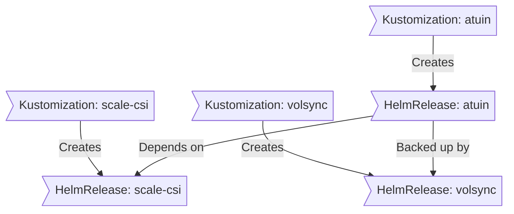

<div align="center">


###  Home Operations Repository 

_Kubernetes cluster running on ESXi VMs with TrueNAS storage, managed with Talos, Flux, and GitOps_ 

</div>

<div align="center">

[](https://discord.gg/home-operations)&nbsp;&nbsp;
[](https://talos.dev)&nbsp;&nbsp;
[](https://kubernetes.io)&nbsp;&nbsp;
[](https://fluxcd.io)&nbsp;&nbsp;
[](https://github.com/GizmoTickler/home-ops/actions/workflows/renovate.yaml)

</div>

<div align="center">

[](https://github.com/kashalls/kromgo)&nbsp;&nbsp;
[](https://github.com/kashalls/kromgo)&nbsp;&nbsp;
[](https://github.com/kashalls/kromgo)&nbsp;&nbsp;
[](https://github.com/kashalls/kromgo)&nbsp;&nbsp;
[](https://github.com/kashalls/kromgo)&nbsp;&nbsp;
[](https://github.com/kashalls/kromgo)&nbsp;&nbsp;
[](https://github.com/kashalls/kromgo)

</div>

---

##  Overview

This repository contains the configuration for my homelab Kubernetes cluster built for learning, experimentation, and running self-hosted applications. The setup emphasizes Infrastructure as Code (IaC) and GitOps practices using [Talos Linux](https://www.talos.dev/), [Kubernetes](https://kubernetes.io/), [Flux](https://github.com/fluxcd/flux2), [Renovate](https://github.com/renovatebot/renovate), and [GitHub Actions](https://github.com/features/actions).

**Architecture**: The cluster runs on VMware ESXi VMs with high-performance TrueNAS storage backing via both iSCSI (for block storage) and NFS 4.1 (for shared media) over 4x10Gbps link aggregation, providing production-grade virtualization with dedicated NVMe storage controllers for optimal performance.

---

##  Kubernetes

The Kubernetes cluster is deployed using [Talos Linux](https://www.talos.dev) on VMware ESXi VMs with high-performance storage provided by TrueNAS over high-speed network connections. This setup provides a production-like Kubernetes environment with dedicated storage controllers for optimal performance.

### Infrastructure Details

- **Hypervisor**: VMware ESXi with advanced virtualization features
- **Storage Backend**: TrueNAS Scale providing iSCSI block storage and NFS 4.1 with multipath over 4x10Gbps link aggregation
- **Network Infrastructure**: Cisco switch with 4x10Gbps LACP between TrueNAS and ESXi
- **Kubernetes Distribution**: Talos Linux (immutable, minimal, secure)
- **VM Configuration**: 3 control plane nodes, each with 16 vCPUs and 48GB RAM
- **Storage Strategy**: Dual NVMe controller architecture per VM:
  - **Controller 1**: 500GB vdisk for Talos boot
  - **Controller 2**: 1TB vdisk for OpenEBS local storage
- **External Storage**: [scale-csi](https://github.com/gizmotickler/scale-csi) for TrueNAS iSCSI persistent volumes with NFS for shared media
- **Networking**: Cilium CNI with eBPF, Gateway API, and L2/BGP announcements
- **Ingress**: Cilium Gateway API with per-application LoadBalancer services
- **DNS**: external-dns for both Cloudflare and Unifi local DNS management

### Core Components

- [actions-runner-controller](https://github.com/actions/actions-runner-controller): Self-hosted GitHub runners for CI/CD workflows.
- [cert-manager](https://github.com/cert-manager/cert-manager): Automated TLS certificate management with Google Trust Services.
- [cilium](https://github.com/cilium/cilium): eBPF-based networking, security, and Gateway API implementation with L2 announcements.
- [cloudflared](https://github.com/cloudflare/cloudflared): Secure tunnels to Cloudflare for external access via Cloudflare Tunnel.
- [external-dns](https://github.com/kubernetes-sigs/external-dns): Automated DNS record management with Cloudflare and Unifi API integration.
- [external-secrets](https://github.com/external-secrets/external-secrets): Kubernetes External Secrets Operator with 1Password Connect integration.
- [flux](https://github.com/fluxcd/flux2): GitOps continuous delivery for Kubernetes with SOPS decryption support.
- [openebs](https://github.com/openebs/openebs): Local persistent volume provisioner for hostPath storage.
- [scale-csi](https://github.com/gizmotickler/scale-csi): Custom TrueNAS Scale CSI driver for iSCSI and NVMEoF block storage and NFS with metrics and Grafana dashboards.
- [sops](https://github.com/getsops/sops): Managed secrets for Kubernetes using age encryption, committed to Git.
- [spegel](https://github.com/spegel-org/spegel): Stateless cluster local OCI registry mirror for improved image pull performance.
- [system-upgrade-controller](https://github.com/rancher/system-upgrade-controller): Automated Kubernetes and Talos Linux upgrades.
- [volsync](https://github.com/backube/volsync): Backup and recovery of persistent volume claims with Kopia.

### GitOps

[Flux](https://github.com/fluxcd/flux2) provides GitOps continuous delivery, watching the [kubernetes](./kubernetes/) folder and applying changes based on Git repository state. The setup includes:

- **SOPS Integration**: Automatic decryption of secrets using age encryption
- **Dependency Management**: HelmReleases and Kustomizations with explicit dependencies
- **Multi-tenancy**: Namespace isolation with proper RBAC
- **Webhook Integration**: GitHub webhook receiver for immediate sync on push

The workflow recursively searches the `kubernetes/apps` folder for `kustomization.yaml` files, which typically contain namespace resources and Flux Kustomizations (`ks.yaml`). Each Kustomization manages HelmReleases or other Kubernetes resources for applications.

[Renovate](https://github.com/renovatebot/renovate) provides automated dependency management across the entire repository, creating pull requests for updates to:
- Container images with digest pinning
- Helm chart versions
- Kubernetes manifests
- GitHub Actions workflows

### Repository Structure

This Git repository is organized for GitOps workflows and infrastructure management:

```sh
📁 home-ops
├── 📁 bootstrap          # Initial cluster bootstrap resources
├── 📁 kubernetes
│   ├── 📁 apps          # Application deployments by namespace
│   │   ├── 📁 actions-runner-system # Self-hosted GitHub runners
│   │   ├── 📁 automation     # Workflow automation (n8n)
│   │   ├── 📁 cert-manager   # Certificate management
│   │   ├── 📁 downloads      # Media acquisition stack
│   │   ├── 📁 external-secrets # Secret management
│   │   ├── 📁 flux-system    # Flux controllers
│   │   ├── 📁 kube-system    # Core Kubernetes components
│   │   ├── 📁 media          # Media serving applications
│   │   ├── 📁 network        # Networking applications
│   │   ├── 📁 observability  # Monitoring and logging
│   │   ├── 📁 openebs-system # Local storage provisioner
│   │   ├── 📁 scale-csi      # TrueNAS Scale iSCSI/NFS storage
│   │   ├── 📁 self-hosted    # Productivity and tools
│   │   ├── 📁 system-upgrade # Automated upgrades
│   │   └── 📁 volsync-system # Volume backup and recovery
│   ├── 📁 components    # Reusable Kustomize components
│   │   ├── 📁 alerts         # AlertManager configurations
│   │   ├── 📁 cluster-secret # Cluster-wide secrets
│   │   ├── 📁 nfs-scaler     # NFS availability scaling
│   │   └── 📁 volsync-direct # Direct volume backup/restore
│   └── 📁 flux          # Flux system configuration
├── 📁 cmd               # HomeOps CLI source code
│   └── 📁 homeops-cli   # Go-based automation tool
├── 📁 scripts           # Automation and utility scripts
└── 📁 talos             # Talos Linux configuration templates
```

### Flux Workflow

This is a high-level look how Flux deploys my applications with dependencies. In most cases a `HelmRelease` will depend on other `HelmRelease`'s, in other cases a `Kustomization` will depend on other `Kustomization`'s, and in rare situations an app can depend on a `HelmRelease` and a `Kustomization`. The example below shows that applications with persistent storage depend on scale-csi being installed and healthy.



### Automation & Tooling

The repository includes comprehensive automation for cluster management through a custom Go-based CLI:

#### HomeOps CLI (`cmd/homeops-cli`)

A purpose-built Go application that provides complete infrastructure automation:

**Core Capabilities:**
- **Bootstrap**: Complete cluster initialization with preflight checks and 1Password integration
- **Talos Operations**: Node configuration, VM deployment, ISO generation, and Kubernetes upgrades
- **VM Management**: ESXi VM creation with custom Talos ISOs and dedicated storage controllers
- **Volume Operations**: VolSync-based backup and restore with Kopia integration
- **Kubernetes Management**: Deployment restarts, PVC browsing, and maintenance operations

**Key Commands:**
```bash
# Bootstrap entire cluster
./homeops-cli bootstrap

# Talos node operations
./homeops-cli talos apply-node --ip 192.168.122.10
./homeops-cli talos deploy-vm --name test_node --generate-iso
./homeops-cli talos upgrade-k8s

# Volume backup/restore
./homeops-cli volsync snapshot --pvc data-pvc --namespace default
./homeops-cli volsync restore --pvc data-pvc --namespace default
```

**Supporting Tools:**
- **Template Rendering**: Embedded Jinja2 templates with [minijinja](https://github.com/mitsuhiko/minijinja)
- **Secret Injection**: [1Password CLI](https://developer.1password.com/docs/cli/) integration for secure secret management
- **Environment Management**: [mise](https://github.com/jdx/mise) for tool and environment variable management
- **Configuration Validation**: Pre-commit hooks with kubeconform and YAML linting
- **CI/CD**: GitHub Actions for automated testing, schema validation, and deployment

---

##  Cloud Dependencies

While most infrastructure and workloads are self-hosted, I rely on cloud services for critical functions to avoid chicken/egg scenarios and ensure availability of essential services regardless of cluster state. This approach balances self-hosting benefits with operational reliability.

Alternative solutions would involve running a separate cloud-hosted Kubernetes cluster for critical services like [Vault](https://www.vaultproject.io/), [Vaultwarden](https://github.com/dani-garcia/vaultwarden), or [ntfy](https://ntfy.sh/), but the operational overhead and costs would likely exceed the current cloud service expenses.

| Service                                         | Use                                                               | Cost           |
|-------------------------------------------------|-------------------------------------------------------------------|----------------|
| [1Password](https://1password.com/)             | Secrets with [External Secrets](https://external-secrets.io/)     | ~$65/yr        |
| [Cloudflare](https://www.cloudflare.com/)       | Domain, DNS, and tunnel services                                 | ~$30/yr        |
| [Google Workspace](https://workspace.google.com/) | Email hosting and productivity suite                           | ~$72/yr        |
| [GitHub](https://github.com/)                   | Repository hosting and CI/CD with Actions                        | Free           |
| [iLert](https://www.ilert.com/)                 | Incident management and alerting                                  | Free (tier)    |
| [Pushover](https://pushover.net/)               | Mobile notifications for alerts                                   | $5 OTP         |
|                                                 |                                                                   | Total: ~$14/mo |

---

##  DNS & Networking

The cluster implements a sophisticated networking architecture using Cilium and Gateway API:

### External Access
- **Cloudflare Tunnel**: Secure external access via `cloudflared` without port forwarding
- **External DNS (Cloudflare)**: Automatic DNS record management in Cloudflare for public services
- **Gateway API**: Cilium-based ingress with dedicated LoadBalancer IPs per application

### Internal Resolution
- **External DNS (Unifi)**: Additional external-dns deployment leveraging Unifi local API for internal DNS record updates
- **CoreDNS**: Kubernetes cluster DNS with custom configurations
- **Cilium Announcements**: Cilium L2/BGP announcements for LoadBalancer IP allocation

### Network Architecture
- **CNI**: Cilium with eBPF datapath for high-performance networking
- **Load Balancing**: Maglev algorithm with DSR (Direct Server Return) mode
- **IP Management**: Kubernetes IPAM with native routing (10.42.0.0/16)
- **Gateway IPs**: Dedicated IP range (192.168.123.101-149) for application access

---

##  Applications

The cluster hosts a variety of self-hosted applications organized by namespace and function:

### Productivity & Tools (self-hosted namespace)

| Application | Purpose | Access |
|-------------|---------|--------|
| [Atuin](https://github.com/atuinsh/atuin) | Shell history sync | `sh.${SECRET_DOMAIN}` |
| [OCIS](https://github.com/owncloud/ocis) | Personal file sync & sharing | `ocis.${SECRET_DOMAIN}` |
| [The Lounge](https://github.com/thelounge/thelounge) | Persistent IRC/web chat client | `thelounge.${SECRET_DOMAIN}` |

### Content & Finance (self-hosted namespace)

| Application | Purpose | Access |
|-------------|---------|--------|
| [Actual](https://github.com/actualbudget/actual) | Personal budgeting | `actual.${SECRET_DOMAIN}` |
| [FreshRSS](https://github.com/FreshRSS/FreshRSS) | RSS feed aggregator | `feeds.${SECRET_DOMAIN}` |
| [Karakeep](https://github.com/karakeep-app/karakeep) | Bookmarking & read-it-later capture | `karakeep.${SECRET_DOMAIN}` |

All self-hosted apps now share the `self-hosted` namespace so VolSync movers and Kopia ownership stay aligned (snapshots live under identities like `app@self-hosted:/data`).

### Media & Requests (media namespace)

| Application | Purpose | Access |
|-------------|---------|--------|
| [Jellyseerr](https://github.com/Fallenbagel/jellyseerr) | Media discovery & request management | `requests.${SECRET_DOMAIN}` |

Media workloads live in the `media` namespace so VolSync and Kopia identities follow `app@media:/data` for consistent restores.

### Downloads & Indexers (downloads namespace)

| Application | Purpose | Access |
|-------------|---------|--------|
| [Autobrr](https://github.com/autobrr/autobrr) | Real-time announce filtering & actions | `autobrr.${SECRET_DOMAIN}` |
| [Bazarr](https://github.com/morpheus65535/bazarr) | Subtitle management for Radarr/Sonarr libraries | `bazarr.${SECRET_DOMAIN}` |
| [Cross-Seed](https://github.com/cross-seed/cross-seed) | Torrent cross-seeding suggestions | Internal only |
| [NZBGet](https://github.com/nzbgetcom/nzbget) | Usenet downloader | `nzbget.${SECRET_DOMAIN}` |
| [Pinchflat](https://github.com/kieranjeglin/pinchflat) | Long-form video & podcast archiving | `pinchflat.${SECRET_DOMAIN}` |
| [Prowlarr](https://github.com/Prowlarr/Prowlarr) | Indexer proxy & search aggregator | `prowlarr.${SECRET_DOMAIN}` |
| [qBittorrent](https://github.com/qbittorrent/qBittorrent) | VPN-protected torrent client with VueTorrent UI | `qbittorrent.${SECRET_DOMAIN}` |
| [Qui](https://github.com/autobrr/qui) | Autobrr queue monitor & dashboard | `qui.${SECRET_DOMAIN}` |
| [Radarr](https://github.com/Radarr/Radarr) | Movie library automation | `radarr.${SECRET_DOMAIN}` |
| [Recyclarr](https://github.com/Recyclarr/Recyclarr) | Radarr/Sonarr config synchronisation | Internal only |
| [TQM](https://github.com/home-operations/tqm) | Automated qBittorrent retag/cleanup jobs | Internal only |
| [Sonarr](https://github.com/Sonarr/Sonarr) | TV library automation | `sonarr.${SECRET_DOMAIN}` |

The entire download stack now lives in the `downloads` namespace so VolSync movers and Kopia ownership stay aligned (`app@downloads:/data`) and restores remain consistent.

### Automation & Workflows (automation namespace)

| Application | Purpose | Access |
|-------------|---------|--------|
| [n8n](https://github.com/n8n-io/n8n) | Workflow automation & integrations | `n8n.${SECRET_DOMAIN}` |

Automation workloads run in the `automation` namespace so VolSync restores and Kopia ownership continue to match `app@automation:/data`.

### Observability Stack (observability namespace)

| Application | Purpose | Access |
|-------------|---------|--------|
| [Grafana](https://github.com/grafana/grafana) | Metrics visualization and dashboards | `grafana.${SECRET_DOMAIN}` |
| [Victoria-Metrics](https://github.com/VictoriaMetrics/VictoriaMetrics) | Metrics collection and alerting | `metrics.${SECRET_DOMAIN}` |
| [Victoria-Metrics-Logs](https://github.com/VictoriaMetrics/VictoriaLogs) | Log aggregation and querying | `logs.${SECRET_DOMAIN}` |
| [Fluent-Bit](https://github.com/fluent/fluent-bit) | Telemetry data collection | Internal only |
| [Alertmanager](https://github.com/prometheus/alertmanager) | Alert routing and management | `alertmanager.${SECRET_DOMAIN}` |
| [Blackbox Exporter](https://github.com/prometheus/blackbox_exporter) | Endpoint monitoring | Internal only |
| [Node Exporter](https://github.com/prometheus/node_exporter) | System metrics collection | Internal only |
| [Kube State Metrics](https://github.com/kubernetes/kube-state-metrics) | Kubernetes metrics | Internal only |
| [KEDA](https://github.com/kedacore/keda) | Kubernetes event-driven autoscaling | Internal only |
| [Kromgo](https://github.com/kashalls/kromgo) | Kubernetes resource metrics API | Internal only |
| [Silence Operator](https://github.com/giantswarm/silence-operator) | Automated alert silencing | Internal only |

### Storage & Infrastructure

| Application | Purpose | Access |
|-------------|---------|--------|
| [scale-csi](https://github.com/gizmotickler/scale-csi) | TrueNAS Scale iSCSI/NFS block storage | Internal only |
| [OpenEBS](https://github.com/openebs/openebs) | Local persistent volume provisioner | Internal only |

All applications use Cilium Gateway API for ingress with automatic TLS certificates from Google Trust Services via cert-manager.

---

##  Storage Architecture

The cluster uses a multi-tier storage architecture designed for performance, reliability, and flexibility:

### Storage Tiers

| Tier | Provider | Protocol | Use Case |
|------|----------|----------|----------|
| **Block Storage** | [scale-csi](https://github.com/gizmotickler/scale-csi) | iSCSI, NVMEoF & NFS | Application persistent volumes (databases, configs) |
| **Local Storage** | OpenEBS | hostPath | High-performance local workloads |
| **Shared Storage** | TrueNAS | NFS 4.1 | Media files, shared data across pods |
| **Backup** | VolSync + Kopia | S3-compatible | Automated PVC backup and restore |

### scale-csi Configuration

The custom [scale-csi](https://github.com/gizmotickler/scale-csi) driver provides native integration with TrueNAS Scale:

- **iSCSI Portal**: Dedicated network path (192.168.120.10:3260)
- **ZFS Dataset**: `flashstor/scale-csi` for all dynamic volumes
- **StorageClasses**:
  - `scale-iscsi` (default): ext4 formatted block volumes
  - `scale-nfs`: NFSv4 shared volumes with noatime
- **Features**:
  - Volume snapshots via CSI snapshot controller
  - Metrics exporting with Grafana dashboards
  - Node-level metrics scraping for performance monitoring

### Backup Strategy

[VolSync](https://github.com/backube/volsync) with [Kopia](https://github.com/kopia/kopia) provides automated backup:

- **ReplicationSource**: Scheduled backups of PVCs to S3-compatible storage
- **ReplicationDestination**: Point-in-time recovery with dataSource references
- **Identity Alignment**: Namespace-based identity (`app@namespace:/data`) for consistent restores

---

##  Hardware

### Physical Infrastructure

| Component                   | Specifications                                      | Function                          |
|-----------------------------|-----------------------------------------------------|-----------------------------------|
| **ESXi Host**               | VMware ESXi Hypervisor                             | VM compute & management           |
| ├─ **CPU**                  | 2x Intel Xeon E5-2640 v4 @ 2.40GHz (20 cores)     | VM compute resources              |
| ├─ **Memory**               | 256GB RAM                                           | VM memory allocation              |
| ├─ **Network**              | 4x 10GbE Intel X540 NICs (LACP to Cisco switch)   | High-speed VM networking          |
| └─ **Storage**              | 2x 500GB SATA SSD                                  | Boot and local datastore          |
| **Storage Server**          | TrueNAS Scale                                       | iSCSI & NFS storage provider      |
| ├─ **CPU**                  | 2x Intel Xeon E5-2630 v4 @ 2.20GHz (20 cores)     | Storage processing                |
| ├─ **Memory**               | 384GB RAM                                           | ARC cache and services            |
| ├─ **Network**              | 4x 10GbE Intel X540 NICs (LACP to Cisco switch)   | Storage network (40Gbps total)   |
| └─ **Protocols**            | iSCSI (block) + NFS 4.1 (file)                     | Kubernetes storage access         |
| **Network Switch**          | Cisco Switch                                        | Infrastructure interconnect       |
| └─ **Configuration**        | 4x10Gbps LACP between TrueNAS and ESXi            | High-bandwidth storage path       |

### Storage Architecture

| Storage Tier                | Hardware                                            | Purpose                           |
|-----------------------------|-----------------------------------------------------|-----------------------------------|
| **TrueNAS Primary Pool**    | 3x RAIDZ vdevs (4 disks each, 3.8TB SSDs)         | iSCSI volumes + NFS exports       |
| **SLOG (Intent Log)**       | 2x 800GB NVMe (mirrored)                           | Synchronous write acceleration    |
| **Special Metadata vdev**   | 2x 1.5TB NVMe (mirrored)                           | Metadata & small block storage    |

### Virtual Machine Configuration

| VM Role                     | Count | vCPU | Memory | Storage Layout                                              | OS            |
|-----------------------------|-------|------|--------|-------------------------------------------------------------|---------------|
| **Kubernetes Control Plane** | 3     | 16     | 48GB   | 500GB NVMe vdisk (boot) + 1TB NVMe vdisk (OpenEBS local)   | Talos Linux   |

**Storage Details**:
- Each VM has two dedicated NVMe controllers for isolation and performance
- Controller 1: 500GB vdisk for Talos boot
- Controller 2: 1TB vdisk for OpenEBS local storage
- Persistent volumes: scale-csi provides TrueNAS iSCSI block storage for application data

**Total VM Resources**: 48 vCPUs, 144GB RAM allocated from the 40-core, 256GB host system.

---

##  Learning & Credits

This homelab serves as a continuous learning platform for cloud-native technologies, GitOps practices, and infrastructure automation. The setup provides hands-on experience with production-grade tools and practices in a controlled environment.

**Special thanks to [onedr0p](https://github.com/onedr0p)** and the [k8s-at-home](https://github.com/k8s-at-home) community. This repository was heavily inspired by onedr0p's [home-ops](https://github.com/onedr0p/home-ops) repository, which served as an excellent learning resource and foundation for understanding GitOps workflows and Kubernetes cluster management.

---

##  Gratitude and Thanks

Thanks to all the people who donate their time to the [Home Operations](https://discord.gg/home-operations) Discord community. Be sure to check out [kubesearch.dev](https://kubesearch.dev/) for ideas on how to deploy applications or get ideas on what you could deploy.
